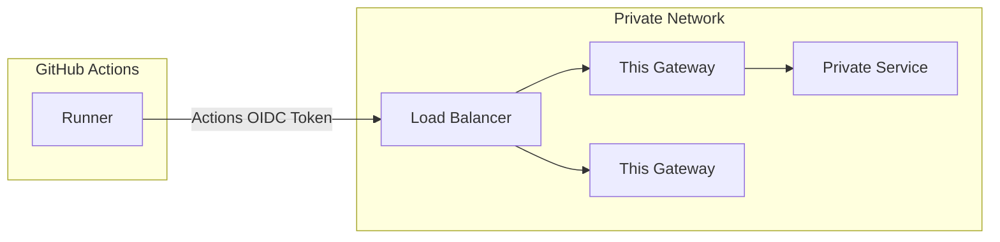

# actions-oidc-gateway-slickdeals

[](https://github.com/Slickdeals/actions-oidc-gateway-slickdeals/actions/workflows/ci.yml)

An OIDC gateway that authorizes traffic from GitHub Actions into your private network, either as an API gateway or as an HTTP CONNECT proxy tunnel.

## Authorization

The gateway validates GitHub Actions OIDC tokens and enforces the following claims:

- **`repository_owner`** must equal `Slickdeals` -- only workflows running in the Slickdeals GitHub Organization are permitted.
- **`aud`** must equal `api://ActionsOIDCGateway` -- prevents token reuse across services.

### Optional repo allowlist

By default, any repository within the `Slickdeals` org is authorized. To restrict access to specific repositories, populate the `allowedRepos` variable in `oidc_gateway.go`:

```go
var allowedRepos = []string{"my-app", "my-service"}
```

When `allowedRepos` is non-empty, only the listed repositories (by name, not `org/repo`) are permitted. When empty, all repos in the org are allowed.

For other claims you can check, see [Configuring the OIDC trust with the cloud](https://docs.github.com/en/actions/deployment/security-hardening-your-deployments/about-security-hardening-with-openid-connect#configuring-the-oidc-trust-with-the-cloud).

## Customization

If you're using this as an API gateway, customize the existing `/apiExample` handler. You can add additional handlers, and even customize the claim checking per handler if you'd like.

Lastly, you are responsible for deploying this gateway in a secure way with access to your private network. There's lots of different options here, but you probably want this gateway to be behind a load balancer that speaks TLS, with scoped network access to the private services it provides access to. That will probably look something like this:



## How would I use this?

Once you customize and deploy your gateway, you can configure your Actions workflow to make use of it:

```yaml
...

jobs:
  your_job_name:
    ...
    permissions:
      id-token: write
    steps:
      ...

      - name: Get OIDC token and set OIDC_TOKEN environment variable
        run: |
          echo "OIDC_TOKEN=$(curl -H "Authorization: bearer $ACTIONS_ID_TOKEN_REQUEST_TOKEN" -H "Accept: application/json; api-version=2.0" "$ACTIONS_ID_TOKEN_REQUEST_URL&audience=api://ActionsOIDCGateway" | jq -r ".value")"  >> $GITHUB_ENV
          echo "::add-mask::$OIDC_TOKEN"

      - name: Example of using gateway as a proxy
        run: |
          curl -v -p --proxy-header "Gateway-Authorization: ${{ env.OIDC_TOKEN }}" -x https://your-load-balancer.example.com https://www.google.com

      - name: Example of an API gateway
        run: |
          curl -v -H "Gateway-Authorization: ${{ env.OIDC_TOKEN }}" https://your-load-balancer.example.com/apiExample

    ...
```
